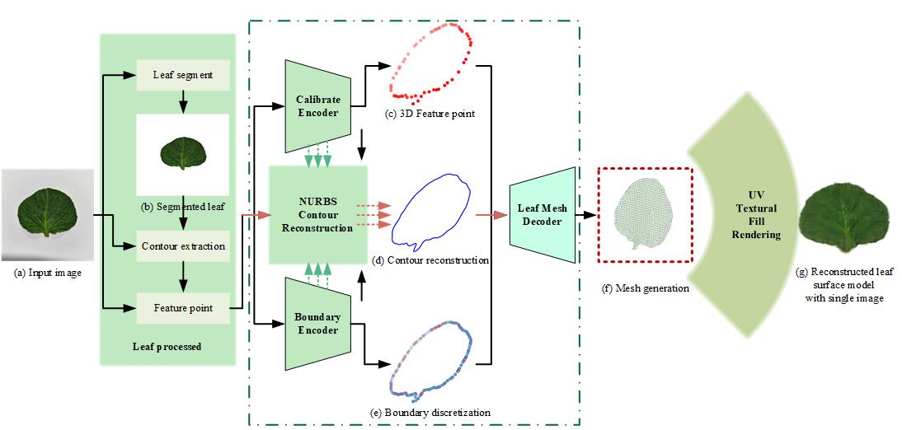

# THREE-DIMENSIONAL MORPHOLOGICAL RECONSTRUCTION OF LEAF FROM A SINGLE IMAGE

## Introduction
In plant morphology studies, 3D scanning technologies have revolutionized leaf structure modeling. However, their high costs and complex operations limit widespread use. To address this, we developed a single-image 3D reconstruction method for mobile phone cameras, focusing on potato leaves. The algorithm starts with an image preprocessing step to enhance quality, followed by leaf segmentation. A 2D contour is then extracted for geometric information, and 3D feature points are identified for spatial details. Contour interpolation links the 2D contour to 3D space, and boundary discretization allows for a 3D mesh creation. Finally, mesh surface optimization ensures model accuracy and realism. Our method was used to reconstruct potato and other crop leaves with minimal shape descriptor deviations and negligible area measurement errors. The reconstructed surface models closely matched the original leaves, demonstrating the potential of our technique to expand conventional modeling applications and advance crop research fields.

